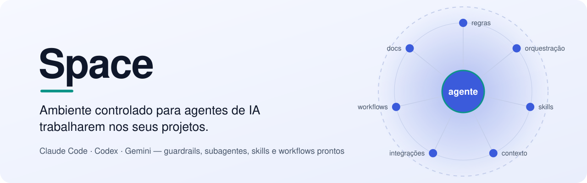
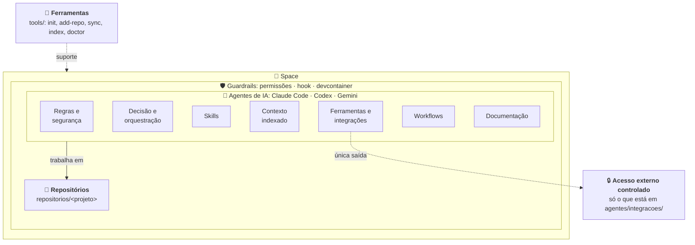

<div align="center">

<picture>
  <source media="(prefers-color-scheme: dark)" srcset=".github/assets/banner-dark.svg">
  
</picture>

<br>

[](LICENSE) [](https://github.com/edersonmelo/space/generate)   

**[Começar](#-começar)** · **[Como funciona](#-como-funciona)** · **[O que vem pronto](#-o-que-vem-pronto)** · **[Guardrails](#%EF%B8%8F-guardrails)** · **[Personalizar](#-personalizar)**

</div>

---

Baixe um **Space**, coloque um ou vários projetos em `repositorios/` e abra o agente na raiz.
Regras, limites de segurança, subagentes, skills e workflows passam a valer para todos os projetos, sem tocar em uma linha do código deles.

> [!TIP]
> Um Space por produto, cliente ou time. Cada um com seus projetos e suas regras.

## 🚀 Começar

**1. Crie o seu Space a partir do modelo**

Clique em **[Use this template](https://github.com/edersonmelo/space/generate)** ou:

```bash
gh repo create meu-space --template edersonmelo/space --private --clone
cd meu-space
```

**2. Prepare**

```bash
tools/init.sh
```

**3. Traga seus projetos** para `repositorios/`, do jeito que preferir:

```bash
tools/add-repo.sh https://github.com/voce/app.git   # clona de um remoto
tools/add-repo.sh ~/Projetos/api                    # clona de uma pasta local com git (sem node_modules, build/…)
cp -R ~/Projetos/site repositorios/site             # ou simplesmente copie a pasta
```

**4. Abra o agente na raiz do Space**

```bash
claude
```

Na primeira vez, aceite a pergunta de confiança da pasta. Depois peça:

```text
use a skill onboard-repo no projeto app
```

> [!IMPORTANT]
> Abra o agente sempre **na raiz do Space**, não dentro de um projeto. É na raiz que valem as permissões, o hook de segurança, os subagentes e as skills.

## 🧭 Como funciona



| Camada | Onde fica | Para quê |
|---|---|---|
| **Ferramentas** | `tools/` | Scripts para preparar o Space, trazer, sincronizar e indexar projetos |
| **Guardrails** | `guardrails/`, `.claude/settings.json`, `.devcontainer/` | Limites do agente: o que pode, o que pede confirmação, o que é proibido |
| **Repositórios** | `repositorios/` | Seus projetos, um por pasta, fora do git do Space |
| **Regras e segurança** | `agentes/regras/` | Padrões e limites compartilhados por todos os agentes |
| **Decisão e orquestração** | `.claude/agents/` | Um orquestrador que distribui o trabalho para especialistas |
| **Skills** | `.claude/skills/` | Capacidades prontas, como preparar um projeto novo |
| **Contexto indexado** | `agentes/contexto/` | Mapa gerado dos projetos: stack, branch, instruções |
| **Ferramentas e integrações** | `.mcp.json`, `agentes/integracoes/` | A única via de acesso a serviços externos |
| **Workflows** | `agentes/workflows/` | Passo a passo para feature, bugfix, release e onboard |
| **Documentação** | `agentes/docs/` | Guias e referências |

## 📦 O que vem pronto

### Subagentes

| Agente | Faz | Não faz |
|---|---|---|
| `orquestrador` | Escolhe o projeto e o workflow, delega e consolida | Escrever código |
| `especificador` | Escreve a spec: comportamento, casos de borda, critérios de aceite | Escrever código |
| `desenvolvedor` | Implementa em qualquer stack: web, APIs, back-end, Android, legado | Deploy, segredos, CI/CD |
| `ios-especialista` | Implementa em Swift, SwiftUI, UIKit, AppKit, Xcode | Assinar, arquivar, publicar |
| `revisor` | Revisa o diff: escopo, segredos, bugs, regras | Editar arquivos |

### Skill

- **`onboard-repo`**: traz um projeto para o Space, indexa, procura segredos expostos e propõe um `CLAUDE.md` para ele.

### Workflows

`feature` · `bugfix` · `release-ios` · `onboard-repo`. Todos em `agentes/workflows/`.

### Índice automático

`tools/index-repos.sh` gera `agentes/contexto/indice.md` com stack, branch, último commit e instruções de cada projeto.
Reconhece Xcode, SwiftPM, Node, Python, Rust, Go, Java, PHP, Ruby, .NET, Flutter, Android e projetos sem git.

### Vários agentes, as mesmas regras

| Agente | Lê |
|---|---|
| Claude Code | `CLAUDE.md` (importa `AGENTS.md` e as regras) |
| Codex | `AGENTS.md` |
| Gemini | `GEMINI.md` (link para `AGENTS.md`) |

## 🛡️ Guardrails

Três camadas, da mais leve para a mais forte:

| Camada | Onde | O que faz |
|---|---|---|
| **Permissões** | `.claude/settings.json` | Bloqueia leitura de `.env`, chaves e certificados; bloqueia `push --force`, `reset --hard` e `sudo`; pede confirmação para commit e push |
| **Hook** | `guardrails/hooks/bloquear-comandos.sh` | Roda antes de todo comando e barra `rm -rf` fora do Space, `curl \| sh`, push forçado, acesso ao Keychain e as pastas de `caminhos-bloqueados.local` |
| **Isolamento** | `.devcontainer/` | Container com firewall: o agente só enxerga o Space e só acessa domínios liberados |

> [!NOTE]
> **Projetos Apple:** Xcode e Simulador só rodam no macOS, então não usam o container. A proteção vem das permissões, do hook e, se quiser mais, do `/sandbox` do Claude Code. Veja [`agentes/docs/guia-apple.md`](agentes/docs/guia-apple.md).

## 🗂️ Estrutura

```text
space/
├── CLAUDE.md · AGENTS.md · GEMINI.md   instruções de entrada dos agentes
├── .claude/
│   ├── settings.json                   permissões e hook
│   ├── agents/                         subagentes
│   └── skills/                         skills
├── .devcontainer/                      container com firewall
├── .mcp.json                           integrações MCP
├── agentes/
│   ├── regras/                         segurança e padrões
│   ├── workflows/                      feature, bugfix, release, onboard
│   ├── contexto/                       índice gerado dos projetos
│   ├── integracoes/                    o que pode acessar fora
│   └── docs/                           guias
├── guardrails/                         hook e pastas bloqueadas
├── repositorios/                       ← seus projetos aqui
└── tools/                              init, add-repo, sync-repos, index-repos, doctor
```

### O que é seu e nunca vai para o git

| Arquivo | Para quê |
|---|---|
| `repositorios/<projeto>/` | Código dos projetos |
| `repositorios/repos.tsv` | Projetos clonados pelo `add-repo.sh`, para recriar o Space em outra máquina com `tools/sync-repos.sh` |
| `guardrails/caminhos-bloqueados.local` | Pastas desta máquina que o agente não pode tocar |
| `agentes/docs/local/` | Suas notas sobre os projetos |
| `.claude/settings.local.json` | Permissões pessoais do Claude Code |

## 🎨 Personalizar

| Quero… | Faça |
|---|---|
| Uma regra nova para todos os agentes | Edite `agentes/regras/padroes.md` ou `seguranca.md` |
| Um subagente novo | Crie `.claude/agents/<nome>.md` e cite-o no `orquestrador` |
| Uma skill nova | Crie `.claude/skills/<nome>/SKILL.md` |
| Uma integração (MCP) | Adicione em `.mcp.json` e registre em `agentes/integracoes/README.md`. Tokens vão em variáveis de ambiente, nunca no arquivo |
| Liberar um domínio no container | Inclua em `PERMITIDOS` no `.devcontainer/init-firewall.sh` |
| Bloquear uma pasta da máquina | Uma linha em `guardrails/caminhos-bloqueados.local` |
| Regras específicas de um projeto | Um `CLAUDE.md` ou `AGENTS.md` dentro do projeto. Ele prevalece sobre as regras gerais |

## ❓ Perguntas frequentes

<details>
<summary><b>Preciso que o projeto tenha git?</b></summary>

Não. Pastas copiadas sem git funcionam e aparecem como "(sem git)" no índice. Os agentes sugerem `git init` antes de mudar algo, para que cada tarefa possa ficar numa branch.
</details>

<details>
<summary><b>O projeto já tem seus próprios agentes em <code>.claude/</code>. Eles funcionam?</b></summary>

O `CLAUDE.md` do projeto é lido normalmente. Subagentes e skills que ficam dentro do projeto não carregam quando o Claude é aberto na raiz do Space; para usá-los, copie para `.claude/agents/` ou `.claude/skills/` do Space.
</details>

<details>
<summary><b>Como levo o Space para outra máquina?</b></summary>

Clone o seu repo do Space, copie o `repositorios/repos.tsv` e rode `tools/init.sh` e `tools/sync-repos.sh`. Projetos que você só copiou para `repositorios/` precisam ser copiados de novo.
</details>

<details>
<summary><b>O Space envia meu código para algum lugar?</b></summary>

Não por conta própria. O código dos projetos não entra no git do Space, e os agentes só acessam serviços externos listados em `agentes/integracoes/`. O que vai para o provedor do modelo de IA depende do agente que você usa.
</details>

---

<div align="center">

[MIT](LICENSE) · feito para trabalhar com agentes de IA com segurança

</div>
